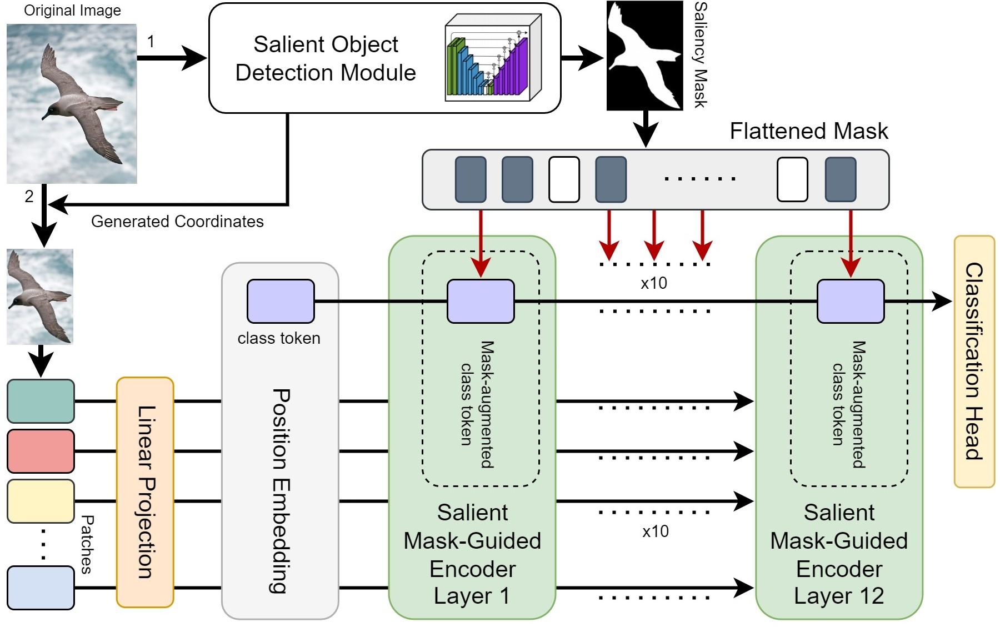

# Salient Mask-Guided Vision Transformer for Fine-Grained Classification
Official repository for the paper "[Salient Mask-Guided Vision Transformer for Fine-Grained Classification](https://www.researchgate.net/publication/366389604_Salient_Mask-Guided_Vision_Transformer_for_Fine-Grained_Classification)", <br>
accepted as a Full Paper to [VISAPP '23](https://visapp.scitevents.org/) (part of [VISIGRAPP '23](https://visigrapp.scitevents.org/)).

> [**Salient Mask-Guided Vision Transformer for Fine-Grained Classification**](https://www.researchgate.net/publication/366389604_Salient_Mask-Guided_Vision_Transformer_for_Fine-Grained_Classification)
> [](https://www.researchgate.net/publication/366389604_Salient_Mask-Guided_Vision_Transformer_for_Fine-Grained_Classification)<br>
> [Dmitry Demidov](https://scholar.google.es/citations?hl=en&pli=1&user=k3euI0sAAAAJ), [Muhammad Hamza Sharif](https://www.researchgate.net/profile/Muhammad-Sharif-44), [Aliakbar Abdurahimov](https://www.researchgate.net/scientific-contributions/Aliakbar-Abdurahimov-2227848477), [Hisham Cholakkal](https://scholar.google.com/citations?user=bZ3YBRcAAAAJ&hl=en), [Fahad Shahbaz Khan](https://scholar.google.es/citations?user=zvaeYnUAAAAJ&hl=en)


## Approach

<p align="center"> 

Main Architecture          | Attention guiding (see Eq. 3 in the paper)
:-------------------------:|:-------------------------:
  | 


</p>

<p align="justify">  In this work, we introduce a simple yet effective approach to improve the performance of the standard Vision Transformer architecture at FGVC. Our method, named SalientMask-Guided Vision Transformer (SM-ViT), utilises a salient object detection module comprising an off-the-shelf saliency detector to produce a salient mask likely focusing on the potentially discriminative foreground object regions in an image. The saliency mask is then utilised within our ViT-like Salient Mask-Guided Encoder (SMGE) to boost the discriminabil-ity of the standard self-attention mechanism, thereby focusing on more distinguishable tokens. </p>

> **<p align="justify"> Abstract:** *Fine-grained visual classification (FGVC) is a challenging computer vision problem, where the task is to automatically recognise objects from subordinate categories. One of its main difficulties is capturing the most discriminative inter-class variances among visually similar classes. Recently, methods with Vision Transformer (ViT) have demonstrated noticeable achievements in FGVC, generally by employing the self-attention mechanism with additional resource-consuming techniques to distinguish potentially discriminative regions while disregarding the rest. However, such approaches may struggle to effectively focus on truly discriminative regions due to only relying on the inherent self-attention mechanism, resulting in the classification token likely aggregating global information from less-important background patches. Moreover, due to the immense lack of the datapoints, classifiers may fail to find the most helpful inter-class distinguishing features, since other unrelated but distinctive background regions may be falsely recognised as being valuable. To this end, we introduce a simple yet effective Salient Mask-Guided Vision Transformer (SM-ViT), where the discriminability of the standard ViT's attention maps is boosted through salient masking of potentially discriminative foreground regions. Extensive experiments demonstrate that with the standard training procedure our SM-ViT achieves state-of-the-art performance on popular FGVC benchmarks among existing ViT-based approaches while requiring fewer resources and lower input image resolution.* </p>


## Main Contributions

1) We introduce a simple yet effective approach to improve the performance of the standard Vision Transformer architecture at FGVC.
2) To the best of our knowledge, we are the first to explore the effective utilisation of saliency masks in order to extract more distinguishable information within the ViT encoder layers by boosting the discriminability of self-attention features for the FGVC task.  
3) Our extensive experiments on three popular FGVC datasets (Stanford Dogs, CUB, and NABirds) demonstrate that with the standard training procedure the proposed SM-ViT achieves state-of-the-art performance.
4) Important advantage of our solution is its integrability, since it can be fine-tuned on top of a ViT-based backbone or can be integrated into a Transformer-like architecture that leverages the standard self-attention mechanism.


<hr />

   
# 🐘 Model Zoo

All models in our experiments are first initialised with publicly available pre-trained [ViT/B-16 model's weights](https://console.cloud.google.com/storage/browser/vit_models;tab=objects?prefix=&forceOnObjectsSortingFiltering=false) and then fine-tuned on the corresponding datasets.

### Results

| Model                         | Input Size | St. Dogs| CUB     | NABirds |     Weights   |
|-------------------------------|:----------:|:-------:|:-------:|:-------:|:-------------:|
| SM-ViT fine-tuned on St. Dogs | 400x400    |  92.3   |  -      |    -    | [link]()      |
| SM-ViT fine-tuned on CUB      | 400x400    |  -      |  91.6   |    -    | [link]()      |
| SM-ViT fine-tuned on NABirds  | 448x448    |  -      |  -      |   90.5  | [link]()      |


<hr />


# 🧋 How to start

## Installation 
For installation and other package requirements, please follow the instructions in [INSTALL.md](docs/INSTALL.md). 

## Data preparation
For datasets preparation, please follow the instructions in [DATASETS.md](docs/DATASETS.md).

## Training and Evaluation
For training, evaluating and reproducing the results, please follow the instructions in [RUN.md](docs/RUN.md).


<hr />


# 🆕 News
* **(Dec 20, 2022)** 
  * Initial commit.
  * Repo description added.

* **(Soon)** 
  * Training and evaluation code are released.
  * Pretrained models are released.


<hr />


# 🖋️ Credits

## Citation
In case you would like to utilise or refer to our approach (source code, trained models, or results) in your research, please consider citing:

```
@article{demidov2022smvit,
    title = {Salient Mask-Guided Vision Transformer for Fine-Grained Classification},
    author = {Demidov, Dmitry and Sharif, Muhammad and Abdurahimov, Aliakbar and Cholakkal, Hisham and Khan, Fahad},
    journal={RG:20914.48323},   
    doi = {10.13140/RG.2.2.20914.48323},    
    year = {2022},
    month = {08}
}
```


## Contacts
In case you have a question or suggestion, please create an issue or contact us at _dmitry.demidov@mbzuai.ac.ae_ .


## Acknowledgements
Our code is partially based on [ViT-pytorch](https://github.com/jeonsworld/ViT-pytorch), [U2N](https://github.com/xuebinqin/U-2-Net), and [FFVT](https://github.com/Markin-Wang/FFVT) repositories and we thank the corresponding authors for releasing their code. If you use our derived code, please consider giving credits to these works as well.
